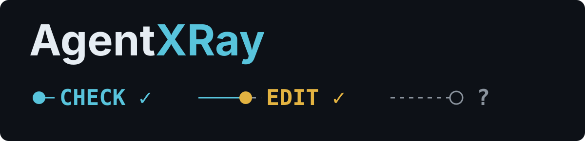
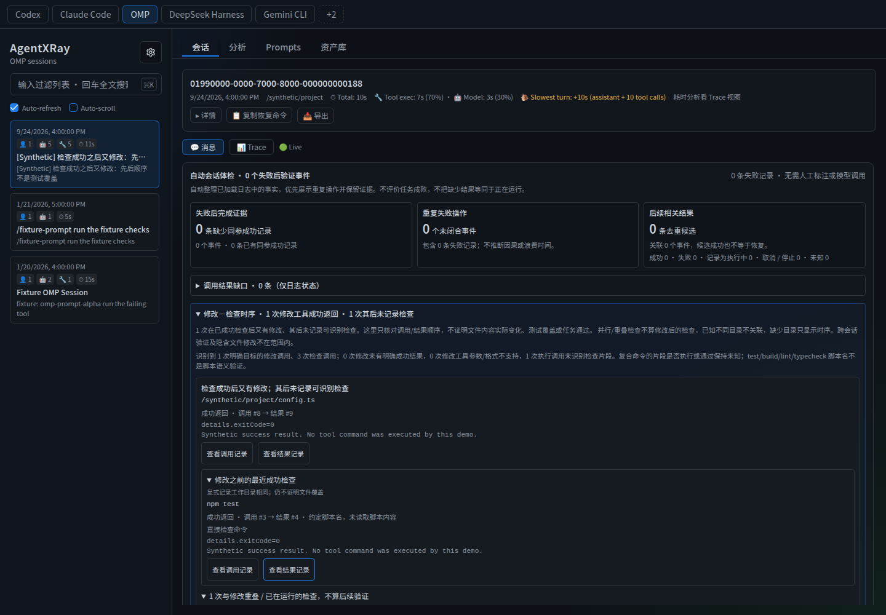

# AgentXRay

**See what your coding agent ran—and what its logs actually verify.**

Read existing session logs locally. Trace failures, background exits and checks after edits back to their source, without an SDK, model call or mandatory human labeling.

<p align="center">
  
</p>

[**Try the demo**](https://alloevil.github.io/AgentXRay/) · [Quick start](#quick-start) · [Evidence & limits](#evidence--limits) · [Roadmap](docs/ROADMAP.md) · [中文](README.zh-CN.md)

[](https://github.com/alloevil/AgentXRay/actions/workflows/test.yml)
[](https://www.npmjs.com/package/@alloevil/agent-xray)

[](LICENSE)

## A passed check is not the whole story

A session can record all three of these facts:

1. A test command returned successfully.
2. An edit tool returned successfully **after that test**.
3. No later recognized check is recorded for that modification.

AgentXRay puts those records next to each other, with links to the original calls and results. It does **not** conclude that the code is broken, that tests cover the changed file, or that the task is done.

That is the difference between counting green tool results and inspecting execution evidence.

## Quick start

**Without installing:** open the [live demo](https://alloevil.github.io/AgentXRay/) and choose **Try diagnostics / 体验自动体检**. The synthetic walkthrough groups **7 pending failure records into 2 events**, with every source record still accessible. It contains no real user sessions.

**With your own logs** — Node.js ≥ 22.13:

```sh
npx @alloevil/agent-xray --host 127.0.0.1
```

Open **http://localhost:3800**, select a platform and session, then inspect its automatic health summary. Supported directories are discovered by default; use Settings to change them. No manual labels are needed. [Installation alternatives and configuration →](docs/usage.md#install)

**For an agent, script or CI job** — inspect one file without starting the dashboard:

```sh
npx @alloevil/agent-xray inspect --platform omp /path/to/session.jsonl --json
```

Replace the path with your log; `codex` and `claude-code` are also accepted. `npx` may download the package; the installed `inspect` command itself makes no network or model calls and never executes logged commands.

**Exit 0 means a report was generated, not that the task passed.** [JSON contract, coverage checks and exit policies →](docs/offline-inspect.md)

## See the evidence



*Real interface, synthetic data. The expanded panel separates an earlier test from an overlapping check and a later modification. [Open the full-size screenshot](screenshots/verification-chronology.png) or [run the interactive chronology demo](docs/diagnostics.md#modification-and-verification-chronology).*

### A reproducible report

From a source checkout with dependencies installed, inspect the committed synthetic OMP walkthrough:

```sh
node bin/agentxray.js inspect --platform omp \
  frontend/demo/sample-logs/omp/-demo-diagnostics/2026-09-23T08-00-00-000Z_0199demo-diagnostics.jsonl --json
```

Excerpt of its generated JSON (other fields omitted):

```json
{
  "summary": {
    "failureRecords": 8,
    "pendingRecords": 7,
    "pendingEvents": 2,
    "recoveredRecords": 1
  }
}
```

There are **8 historical failures**; **7 remain pending in 2 events**, and **1 has matching later success evidence**. The report also includes source lines, call states and rule hashes. These are log facts—not eight broken tasks or a success score.

## What you can inspect

- **Failures without losing evidence.** Group repeated unresolved operations by tool, complete arguments and user turn. Keep every original result; a group is not a root-cause diagnosis.
- **Background completion.** Follow supported Codex launch → poll → exit records. A process starting is not evidence that it finished; conflicting IDs stay unknown.
- **Checks around edits.** Distinguish before, overlapping and later checks. A successful pipeline wrapper does not prove its test fragment passed.
- **What remains unknown.** Surface missing, running, cancelled and ambiguous results rather than turning an incomplete log green.
- **The surrounding session.** Browse tool arguments/results, traces and sub-agents; search across platforms; inspect per-turn tokens and cost when reported.
- **Optional tools, not prerequisites.** Keep review notes, transfer exact evidence-matched reviews, curate prompts or archive sessions. Automatic evidence works without them.

[Complete feature catalog and screenshot gallery →](docs/usage.md#features) · [Diagnostic rules and boundaries →](docs/diagnostics.md)

## Compatibility

**Dashboard:** OpenClaw, Codex, Claude Code, Hermes, OMP, DeepSeek Harness and Gemini CLI. Hermes uses SQLite; the other six adapters read JSONL-backed logs. Compressed DeepSeek Harness logs require Node.js ≥ 22.15.

**Offline `inspect`:** Codex, OMP and Claude Code only; one stable UTF-8 JSONL file, up to 64 MiB. Known adapter loss produces incomplete coverage, not a clean result. Dashboard support does not imply equal diagnostic coverage across formats.

[Default directories and overrides](docs/usage.md#configuration) · [Formats and path patterns](docs/usage.md#supported-log-formats)

## Evidence & limits

**Implemented and tested:** local browsing, deterministic execution-evidence rules and the offline report. The UI and CLI share their diagnostic source; tests check source references, conservative matching and temporal counterexamples. [CLI validation](test/inspect.test.js) · [UI and fixture verification](docs/diagnostics-verification.md) · [Recompute published claims](claims.json)

**Not established:** improved real-world agent completion, lower costs or less developer time. In the [initial synthetic pilot](experiments/effectiveness-pilot/RESULTS.md), all three arms passed **12/12** tasks; AgentXRay did not demonstrate an advantage over mechanical context. These experiments live under `experiments/`, are not included in the npm package, and are not default product behavior.

**Not a completion judge:** no root-cause inference, automatic repair, test-coverage proof or live process monitoring. A missing record is missing evidence, not proof that an operation did not happen. If you need instrumented production tracing or a hosted team service, this local log reader is not that product.

### Local by default, explicit about egress

Core log browsing and `inspect` do not send logs to a model. The UI is self-contained. Optional prompt rewriting/suggestions use your configured endpoint or the `claude` CLI fallback, which may contact a remote provider; Fabric import downloads patterns from GitHub. Installation can contact package registries. Do not use model-powered prompt features when you require no model egress.

Separately invoked research runners can make remote calls with gated sanitized copies; they are not launched by normal browsing or `inspect`. Minimized reports and automated sanitization are **not anonymity guarantees**. [Privacy and usage details →](docs/usage.md#faq)

## Documentation & contributing

- [Usage, configuration and HTTP API](docs/usage.md) · [中文使用参考](docs/usage.zh-CN.md)
- [Offline report contract](docs/offline-inspect.md) · [Automatic evidence and optional reviews](docs/diagnostics.md)
- [Roadmap and acceptance criteria](docs/ROADMAP.md) · [Experimental evaluation protocol](experiments/prospective-study/REMOTE.md)
- [Development, tests and platform adapters](docs/usage.md#development) · [Report a bug](https://github.com/alloevil/AgentXRay/issues)

For a parser or evidence bug, include the CLI/version, expected behavior and a **minimal synthetic or carefully sanitized reproducer**. Do not post full personal session logs or credentials. Findings with an executable reproducer are more useful than an unexplained screenshot.

## License

[MIT](LICENSE)
