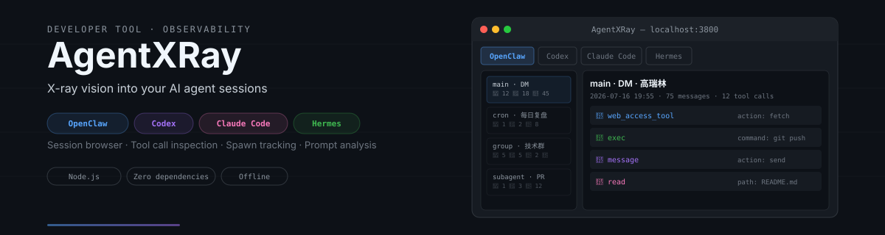
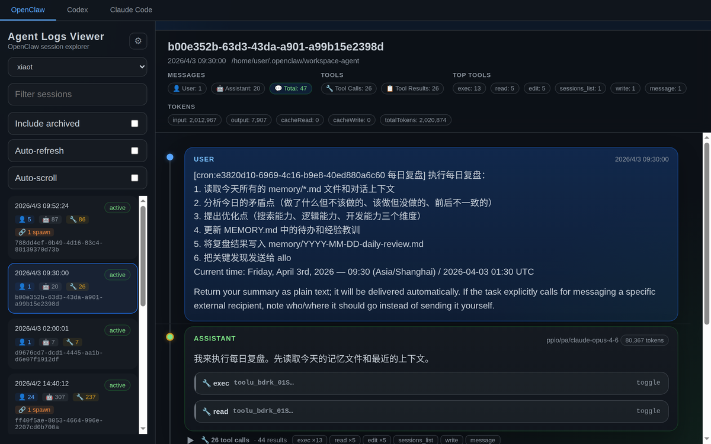
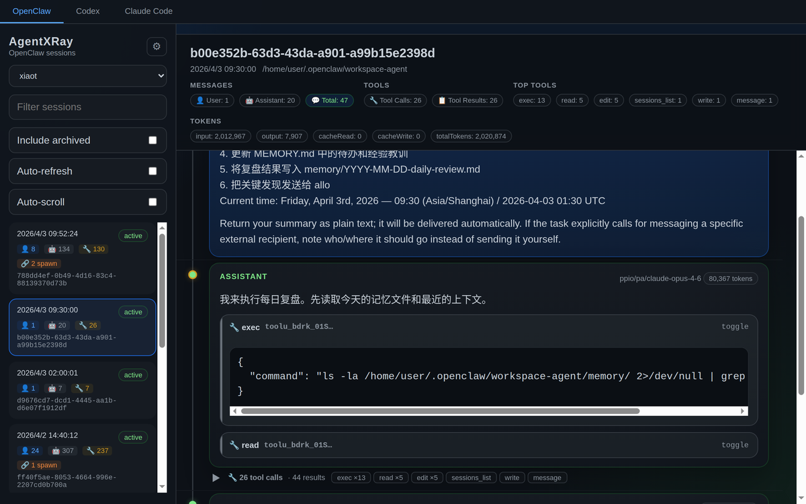
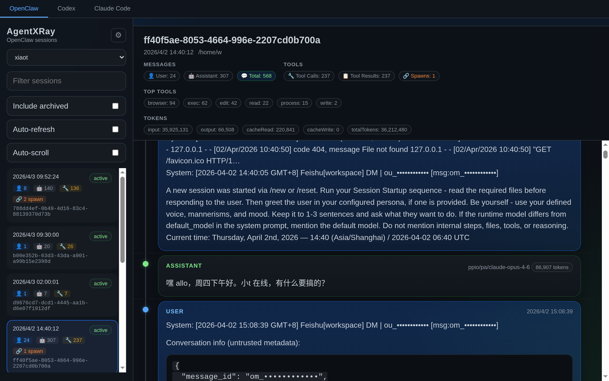
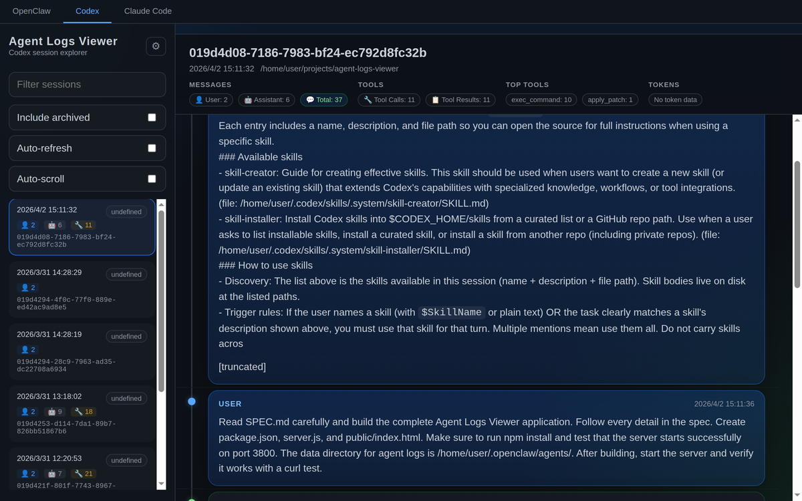
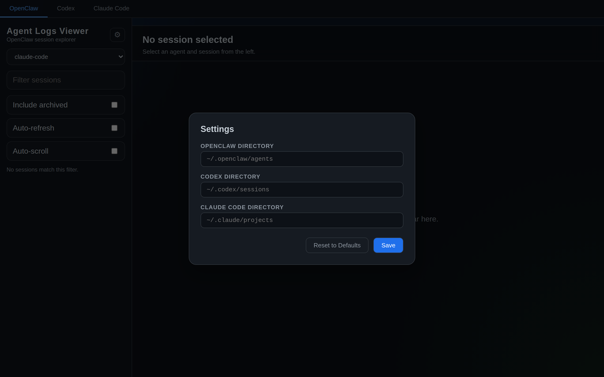

<p align="center">
  
</p>

<p align="center">
  
  <a href="https://github.com/alloevil/AgentXRay/actions/workflows/test.yml"></a>
  <a href="https://github.com/alloevil/AgentXRay/releases/latest"></a>
  
  
  
  
</p>

<p align="center">
  <a href="#quick-start">Quick Start</a> ·
  <a href="#features">Features</a> ·
  <a href="#screenshots">Screenshots</a> ·
  <a href="#api">API</a> ·
  <a href="README.zh-CN.md">中文</a>
</p>

---

X-ray vision into your AI agent sessions. Supports **OpenClaw**, **Codex**, **Claude Code**, **Hermes** and **OMP** — all in one interface.

---

## Features

- **Multi-platform** — Unified view across OpenClaw, Codex, Claude Code, Hermes and OMP sessions
- **Session browser** — Browse agents, filter/search sessions, view message history
- **Tool call inspection** — Expandable tool calls with arguments and results
- **Trace view** — Per-turn waterfall of where the time went: model inference (blue) vs tool execution (green, red on error); click any bar to jump to that message
- **Prompt extraction** — See every real human prompt per session (tool results, slash commands and injected noise filtered out), grouped by working directory, with search / JSON export / copy
- **Prompt optimization** — Cluster prompts into templates, attribute session outcomes (turns, tool calls, error rate) per template, and get Claude-powered rewrite suggestions via the local `claude` CLI
- **Prompt library** — Curate the prompts worth keeping into `~/.agentxray/library`, tag / edit / search them, then install any of them as a native slash command for Claude Code, Codex or OMP with one click — `$ARGUMENTS` is passed through, so `/name some args` works in the target CLI
- **Global search** — One search box across all five platforms at once, multi-keyword AND matching, colored platform badges per hit — including prompts recovered from sessions that Claude Code's cleanup already deleted
- **Session insights** — Aggregate analytics dashboard with tool stats, error clustering and daily trends
- **Spawn tracking** — Detect and navigate parent/child agent relationships
- **OMP sub-agents** — Sub-agents spawned by an OMP session show up as chips in the summary; click one to read the child agent's full transcript
- **Message timeline** — Visual graph showing conversation flow with role indicators
- **Resume command** — One click copies the exact command to resume a session in its own CLI (`codex resume`, `claude --resume`, `omp --resume=`)
- **Collapsible summary** — Fold the session summary away when you want the full height for messages
- **Auto-refresh** — Live-updating session list and messages
- **Settings panel** — Configure platform directories from the UI, persisted in localStorage
- **Session backup** — Incremental archive of your session logs into `~/.agentxray/archive`, one click in settings (also runs automatically, daily); unchanged files are skipped
- **Keyboard navigation** — Arrow keys to move between sessions

---

## Screenshots

### Session Browser

Browse agents and sessions in the sidebar. Each session card shows message counts by role (👤 User, 🤖 Assistant, 🔧 Tool) and spawn indicators. The main panel displays session metadata, token usage, and top tools at a glance.



### Tool Call Inspection

Expand any tool call to see its arguments and result. Collapsed groups show tool type counts for quick scanning.



### Spawn Tracking

Sessions that spawn sub-agents are marked with a 🔗 badge. Click to navigate the parent/child relationship chain.



### Multi-Platform Support

Switch between OpenClaw, Codex, Claude Code, and Hermes with one click. Each platform's sessions are parsed from their native log format.



### Settings

Configure platform directories from the UI. Changes are saved to localStorage — no server restart needed.



---

## Quick Start

**Option 1 — npx** (no clone; available once the package is published to npm)

```bash
npx agent-xray            # default http://localhost:3800
npx agent-xray --port 3900 --host 127.0.0.1
```

A global install (`npm i -g agent-xray`) exposes the same launcher as `agentxray`.

**Option 2 — from source**

```bash
git clone https://github.com/alloevil/AgentXRay.git
cd AgentXRay
npm install
npm start
```

Open http://localhost:3800

---

## Usage

### Basic Workflow

1. **Select a platform** — Click `OpenClaw`, `Codex`, `Claude Code`, or `Hermes` in the top bar
2. **Pick an agent** — For OpenClaw, choose an agent from the dropdown (e.g. `xiaot`, `mimo`)
3. **Browse sessions** — Sessions are sorted by date, newest first. Each card shows:
   - Timestamp and status (`active` / `archived`)
   - Message counts: 👤 User, 🤖 Assistant, 🔧 Tool calls
   - 🔗 Spawn badge if the session spawned sub-agents
4. **View messages** — Click a session to load its full conversation
5. **Inspect tool calls** — Click any `🔧 tool_name` button to expand arguments/results
6. **Navigate spawns** — Click the 🔗 link to jump to the spawned child session

### Prompt View

Click the **Prompts** tab (next to Sessions / Insights) to see every real human prompt across all sessions, grouped by the session's working directory. Noise like tool results, slash-command echoes, system reminders and task notifications is filtered out.

- **Preview & expand** — Each session row shows a one-line preview of its first prompt; click to expand the full markdown-rendered prompt list
- **Search** — Filter prompts / directories / sessions live
- **Export JSON** — Download all extracted prompts for offline processing
- **分析优化 (Analyze)** — Cluster prompts into templates, attribute session outcomes (avg turns, tool calls, error rate) per template, and get rewrite suggestions from Claude. Requires the [`claude` CLI](https://claude.com/claude-code) on the server's PATH; without it the clustering and attribution table still works
- **优化 (Optimize)** — Hover any single prompt and click 优化 for an inline Claude-powered rewrite

### Keyboard Shortcuts

| Key | Action |
|-----|--------|
| `↑` / `↓` | Move between sessions |
| `Enter` | Select highlighted session |

### Filtering & Search

- **Search box** — Filter sessions by ID or content
- **Include archived** — Toggle to show/hide archived (`.reset.*` / `.deleted.*`) sessions
- **Auto-refresh** — Automatically poll for new sessions and messages
- **Auto-scroll** — Scroll to the latest message when new content arrives

---

## Configuration

### Default directories

| Platform    | Default path                  |
|-------------|-------------------------------|
| OpenClaw    | `~/.openclaw/agents`          |
| Codex       | `~/.codex/sessions`           |
| Claude Code | `~/.claude/projects`          |
| Hermes      | `~/.hermes`                   |
| OMP         | `~/.omp/agent/sessions`       |

### Custom directories

**Via UI:** Click the gear icon in the sidebar to set custom paths per platform. Saved to localStorage, no restart needed.

**Via environment variables:**

```bash
OPENCLAW_DIR=/custom/path/openclaw \
CODEX_DIR=/custom/path/codex \
CLAUDE_CODE_DIR=/custom/path/claude \
HERMES_DIR=/custom/path/hermes \
OMP_DIR=/custom/path/omp \
npm start
```

**Via API:** Pass `?dir=/absolute/path` query parameter to any API endpoint.

---

## API

| Endpoint | Description |
|----------|-------------|
| `GET /api/agents` | List OpenClaw agents |
| `GET /api/agents/:name/sessions` | List sessions for an agent |
| `GET /api/agents/:name/sessions/:id` | Get session messages |
| `GET /api/codex/sessions` | List Codex sessions |
| `GET /api/codex/sessions/:id` | Get Codex session messages |
| `GET /api/claude-code/sessions` | List Claude Code sessions |
| `GET /api/claude-code/sessions/:id` | Get Claude Code session messages |
| `GET /api/hermes/sessions` | List Hermes sessions |
| `GET /api/hermes/sessions/:id` | Get Hermes session messages |
| `GET /api/omp/sessions` | List OMP (oh-my-pi) sessions |
| `GET /api/omp/sessions/:id` | Get OMP session messages |
| `GET /api/spawn-map` | Build agent spawn relationship map |
| `GET /api/insights` | Aggregate analytics (tool stats, error clusters, trends) |
| `GET /api/prompts` | Real human prompts per session, grouped by directory |
| `GET /api/prompts/analyze` | Template clustering + attribution + Claude suggestions (`?refresh=1` to recompute, `?skipLlm=1` for clustering only) |
| `POST /api/prompts/rewrite` | Rewrite a single prompt via the claude CLI (`{ "text": "..." }`) |
| `GET /api/search` | Full-text search across sessions (`?platform=all` searches every platform at once, multi-keyword AND) |
| `GET /api/omp/sessions/:id/children` | List sub-agents spawned by an OMP session |
| `GET /api/omp/sessions/:id/children/:name` | Get a spawned sub-agent's messages |
| `GET /api/library` | List library prompts with their per-target install state |
| `POST /api/library` | Create a prompt (`{ "name": "...", "content": "...", "description": "...", "tags": [...] }`) |
| `PUT /api/library/:name` | Update / rename a prompt (`newName`, `content`, `description`, `tags`); installed copies are refreshed |
| `DELETE /api/library/:name` | Delete a prompt and any installed slash commands |
| `POST /api/library/:name/install` | Install as a slash command (`{ "targets": ["claude", "codex", "omp"] }`) |
| `POST /api/library/:name/uninstall` | Remove the installed slash commands (same body) |
| `POST /api/library/suggest-name` | Suggest a library name for a prompt via the claude CLI (`{ "text": "..." }`; `null` when the CLI is unavailable) |
| `POST /api/backup` | Run an incremental backup into `~/.agentxray/archive` |
| `GET /api/backup/status` | Archive stats: file count, total bytes, last backup time |

All list/detail endpoints accept an optional `?dir=` parameter to override the default directory.

---

## Tech Stack

- **Backend:** Node.js + Express
- **Frontend:** Single-file HTML/CSS/JS (~70KB, no build step, no framework)
- **Data:** Reads JSONL session files directly from disk
- **Zero external CDN** — Everything is self-contained, works offline

---

## Supported Log Formats

| Platform | Format | Path Pattern |
|----------|--------|--------------|
| OpenClaw | JSONL | `~/.openclaw/agents/{agent}/sessions/{id}.jsonl` |
| Codex | JSONL | `~/.codex/sessions/{id}.jsonl` |
| Claude Code | JSONL | `~/.claude/projects/*/sessions/*/session.jsonl` |
| Hermes | SQLite | `~/.hermes/state.db` |
| OMP | JSONL | `~/.omp/agent/sessions/*/{timestamp}_{id}.jsonl` |

Archived sessions (`.jsonl.reset.*`, `.jsonl.deleted.*`) are also supported when "Include archived" is enabled.

---

## Development

Tests live in `test/` and use Node's built-in test runner — no extra dependencies. Run `npm ci` once, then `npm test` (`node --test test/*.test.js`). The tests start their own server on a random port with `HOME` and every platform directory pointed at a throwaway copy of `test/fixtures/home`, so your real session logs are never read or modified. CI runs the same two commands on Node 22 for every push and pull request to `master` (see `.github/workflows/test.yml`).

---

## License

[MIT](LICENSE)

---

<p align="center">
  <sub>⭐ Star this repo if you find it useful!</sub>
</p>
