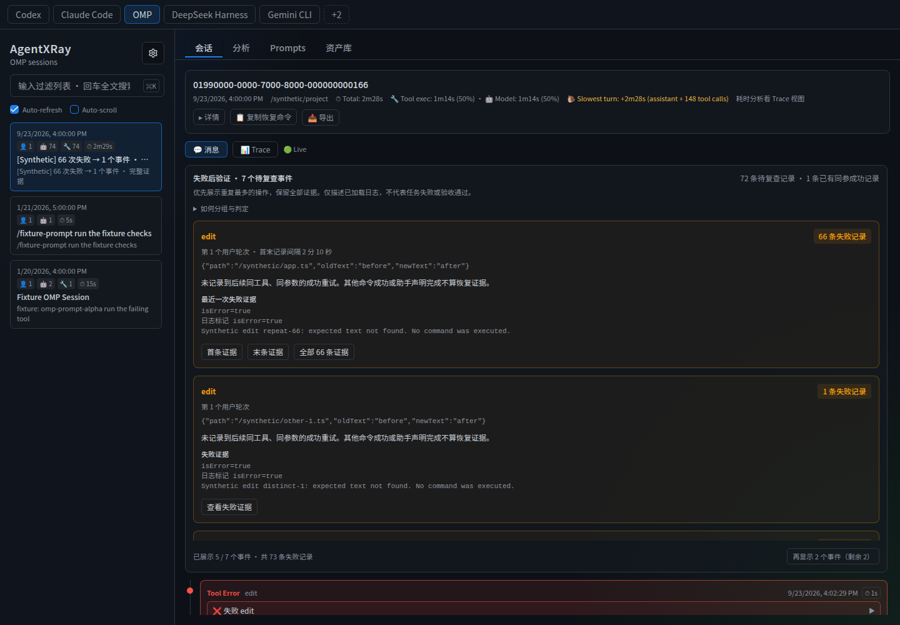
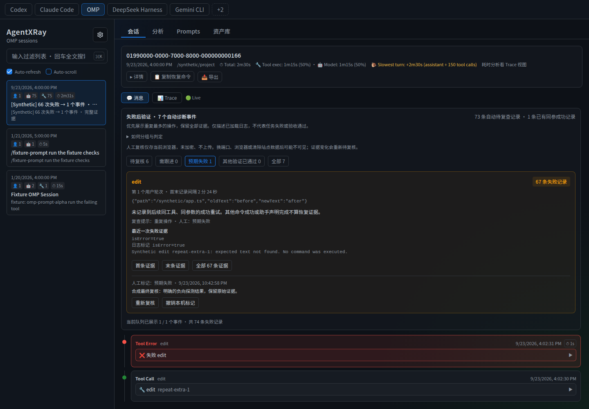
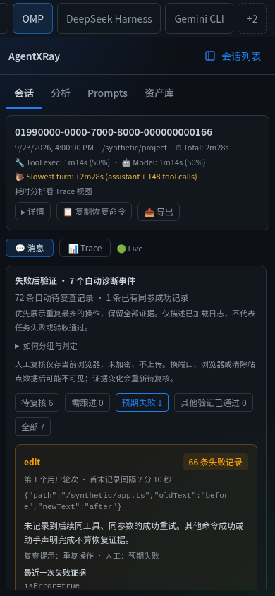

# Evidence-backed failure events

**Find repeated failed operations without losing the evidence.** AgentXRay groups recorded failures for review; it does not decide whether the agent finished your task correctly.

This guide covers the React UI. The synthetic terminal walkthrough uses a source checkout; package installation and published versions are listed in GitHub Releases.

## Try it without sharing your logs

From the repository root, after installing the root and frontend dependencies:

```sh
npm run build:ui
node scripts/demo-diagnostics.cjs
```

Open the printed local address, select **OMP**, then the **[Synthetic]** session. The script creates a temporary HOME with synthetic logs, not your real sessions. It executes no logged tool commands and needs no model credentials.

1. **Start with the summary:** 72 pending failure records become 7 events. The first card contains 66 failures of the same edit operation. Five event cards appear initially; “再显示…” reveals the rest.
2. **Follow the evidence:** “首条证据” / “末条证据” jump to the first / last result. “全部 66 条证据” retains every result, including different error text, with individual jump buttons. A jump expands the original tool result, including results outside message pagination.
3. **Watch the update:** keep Auto-refresh enabled, enter `r` in the demo terminal, then press Enter. The script appends a synthetic same-argument success. The repeated event disappears: 6 pending records / 6 events remain, and 67 failed records now have later matching success evidence (including one earlier synthetic recovery).
4. Enter `q` or press Ctrl-C to stop the isolated server and remove its temporary data.

The synthetic “66 → 1” example is a fixture, not an accuracy or productivity benchmark.



## Use your existing logs

Run `npm start` from the built checkout. Select a session and open its **消息** view. The “失败后验证” panel uses the currently loaded transcript; selecting a child session analyzes the child, not the parent's combined history. No SDK, new log instrumentation or model call is required for these rules.

Start with repeated operations, open the latest failure, and inspect the surrounding calls. A card is a reason to review the transcript—not an instruction to rerun a possibly destructive command. Equivalent commands, alternate verification and external fixes still require your judgment.

## Local review workflow

The automatic result and your judgment are separate. The header always reports automatic events and pending failure records. The review filters show which of those events you have inspected:

| Queue | Meaning |
| --- | --- |
| 待复核 / Unreviewed | No current review, evidence changed, or local review could not be read. |
| 需跟进 / Follow-up | You recorded a concrete next check or unresolved concern. |
| 预期失败 / Expected failure | You recorded why this failure was expected, such as a negative probe. |
| 其他验证已通过 / Verified elsewhere | You recorded alternative verification that the exact-argument rule cannot establish. This is your note, not an automatic success claim. |
| 全部 / All | All automatic events, including manually reviewed ones, with their original evidence. |

Click **记录人工复核**, choose a status and write **1–1000 characters of evidence or next steps**. Save, change or revoke a review without modifying session logs. Start with **待复核** next time; **需跟进** is your follow-up list. An empty review queue does not imply a passed task.

Notes survive refresh in the same browser and origin, and updates sync between tabs on that origin. Notes are separated by platform, configured log directory, session, child and event. Event identifiers and full-evidence revisions are SHA-256 fingerprints; the app does not copy raw logs or arguments into the review store. Your note itself is stored as plain text, so **do not paste secrets**.

Appending a failure or changing the full result—including text beyond the displayed preview—invalidates the old revision. The event returns to **待复核**, and where its identity is unchanged the old note remains visible with an expiration warning. Changed event identities (for example changed parameters or shifted first occurrence) start unreviewed rather than reusing a potentially unrelated note.

**Try invalidation:** in the synthetic demo, save a review on the 66-failure event, then enter `n` in the terminal. A new failure joins the event (67 failures), and the old review becomes stale without a page reload. Enter `r` afterward to append a matching success: that event leaves the automatic queue, with 68 recorded failures now having matching success evidence. If you did not use `n`, the original demo count remains 67 recovered records.



Storage limits:

- Reviews stay in this browser's localStorage, not on the AgentXRay server, in your session logs or in the cloud. No review API, account or model call is used.
- They are not encrypted, authenticated attestations or a backup. Another browser, a changed hostname/port, private mode or cleared site data may make them unavailable. Other tabs use the latest saved record; there is no collaborative edit merge.
- Storage denial, a corrupt record or quota exhaustion is shown explicitly. A failed save does not count as saved; unreadable reviews remain unreviewed. You can revoke an individual review without clearing unrelated settings.
- Use localhost or HTTPS for browser cryptography. If fingerprints cannot be calculated, saving reviews is disabled while automatic diagnostics remain available.
- Notes are not automatically deleted when an event becomes automatically recovered or its identity changes; they may remain in site storage. There is no review archive, export/import or cross-device sync in this version.

## What an event means

| Rule | Behavior |
| --- | --- |
| Same operation | Exact tool name and complete argument values; object key order is ignored, array order and values are preserved. OMP's `i` field is not stripped. |
| User-turn boundary | Calls must originate in the same user turn. A late result stays in its call's turn. No user message yet is shown explicitly. |
| Success boundary | A matching successful result separates later groups. Only a call started after the failure can recover that failure; pre-existing parallel calls cannot. Recovery itself is not restricted to one user turn. |
| Missing data | Missing calls/arguments stay separate. Unknown completion does not silently become success. |
| Evidence | Each pending failure belongs to exactly one event. First, last and every member remain accessible. Ranking is by member count, then first occurrence. |
| Time | The card reports the interval between first and last failure records, not execution duration or time wasted. Missing, invalid or non-monotonic timestamps produce unknown duration. |
| No causal claim | Errors may differ and calls may overlap. Grouping does not prove a common cause, serial retries, an infinite loop, deception or task failure. |

OMP results distinguish success, failure, running, cancelled and unknown with field-source evidence. Eval/search nested errors are recognized; stopping a daemon or listing historical failures is not automatically a new execution failure. A successful eval containing error observations keeps those observations visible: process success does not prove the probe or task passed.

Existing aggregate error statistics still use their original `isError` field. They may differ from this diagnostic count; this feature does not migrate those metrics.

## Narrow-screen session workflow

Below 768px, the session workflow uses the available width rather than reserving a fixed sidebar:

- Tap **会话列表** to open navigation. Select a session—even the currently selected one—to return to its content. **返回内容** or Escape also closes navigation; keyboard focus returns to the toggle.
- Session-list search and the current review form remain mounted while switching between list and content. This preserves an unsaved draft **within the same session**; it does not promise draft persistence across session changes or page reloads.
- Scroll the platform bar horizontally to reach more platforms. The active platform stays visible; desktop displays the existing two-column layout at 768px and above.
- The summary has a height limit on narrow screens, including short landscape viewports. Expanded details scroll inside the summary, leaving space for the transcript.
- First/last/individual evidence jumps scroll the message area, not the outer page, so navigation remains available. Review notes and stale-evidence handling work as on desktop.

Validated in Chromium at 360×640, 390×844, 740×360, 768×1024 and 1440×1000. A separate mobile/touch emulation passed tap navigation and review saving. At 360px, the actual diagnostic panel is **340px wide**, up from the previous broken 44px layout. This replaces the earlier component-only narrow-screen check.



These checks cover navigation, session messages and the review workflow—not complete mobile certification of Trace, analytics, prompts, library or every settings control. No physical iOS/Android device or on-screen keyboard was tested. This UI change does not alter server network binding or expose your logs for remote access. Review storage still requires a suitable browser origin (localhost or HTTPS for fingerprints). [Verification receipt](diagnostics-verification.md).

## Reproducible checks

```sh
node --test test/diagnostic-events.test.js test/diagnostics.test.js test/omp-outcome.test.js
node --test test/diagnostic-reviews.test.js
npm test
npm run build:ui
npm run lint
```

The local frozen regression set contained 30 sessions and 9,076 tool results. Grouping reduced 438 pending cards to **373 events (14.84% fewer cards)**, retaining all 438 evidence records. One event contains 66 edit failures. Failure detection and recovery counts did not change. This already-inspected set is not a blind evaluation, an accuracy estimate or evidence of time saved. Real logs are not included in the repository; the synthetic demo works without them. [Local verification receipt](diagnostics-verification.md).

## 中文使用指南

**目标：先找到值得复查的重复操作，再追溯证据，而不是把几百条失败强行解释成几个根因。**

从源码仓库运行 `npm run build:ui`，再运行 `node scripts/demo-diagnostics.cjs`。打开终端打印的地址，选择 OMP 的 `[Synthetic]` 会话：

- 初始为 **72 条待复查记录 → 7 个事件**，66 条同参 edit 失败集中在第一张卡片；默认展示 5 个事件，可以继续加载。
- 点击“首条证据”“末条证据”或“全部 66 条证据”，可以跳转任意一条原始结果，不因聚合丢失细节。
- 保持自动刷新，在终端输入 `r` 并回车，追加合成成功结果；页面自动变为 **6 个事件、6 条待复查记录、67 条已有同参成功记录**。
- 输入 `q` 或 Ctrl-C 退出并清理。演示使用临时 HOME 和合成日志，不读取你的真实会话、不执行日志里的命令。

日常使用：构建后运行 `npm start`，选择你的会话，在“消息”视图查看“失败后验证”。子会话独立分析；优先读最新失败和前后操作，不要不加判断地重跑原命令。

**边界：**只合并同调用轮次、同工具、完整同参数的记录，不忽略 `i` 或工作目录；成功结果切断分组，缺少参数不合并。事件可含并行调用和不同错误，不等于同一根因或串行重试。首末间隔不是耗时或浪费时间。执行中、取消和未知不算成功验证；其他方式修复、等价命令、后台任务链仍需人工判断。

本机冻结回归是 **438 → 373 个事件，少 14.84% 卡片，保留全部 438 条证据**，不是“问题减少了 14.84%”，也没有证明省下多少时间。既有聚合统计仍使用原始错误标记，可能与诊断数字不同。源码体验与安装方法见本页及 GitHub Releases；合成终端演示需要源码检出。

会话与复核流程的窄屏布局现已修复；此前 360px 下固定侧栏挤压正文的问题不再存在，具体范围见“窄屏操作”。其他复杂页面没有因此被宣称全面适配。

## 本机复核闭环

先从“待复核”开始，打开事件证据，点击“记录人工复核”，选择：

- **需跟进**：写清楚下一步检查什么、哪里仍不确定。
- **预期失败**：写清楚为什么这个失败是合理的，例如负向探测无匹配。
- **其他验证已通过**：记录替代验证的命令、结果与时间；这是人工判断，不是自动成功证据。

每次必须填写 1–1000 字依据。可重新复核、撤销单条标记，或在“全部”中查看所有自动事件。**复核队列为空，不代表任务通过**；人工标记不会改变顶部的自动失败/恢复计数。

在合成演示里，先给 66 条失败的事件写一条依据，再在终端输入 `n`：第 67 条失败加入后，旧标记失效、事件重新待复核，并保留旧依据供对照。此后输入 `r`，自动成功记录才会关闭这一事件（累计 68 条恢复，包含先前演示中的 1 条）。

**存储边界：**标记只在当前浏览器同源 localStorage 中保存，刷新可恢复、同源多标签页会同步，但不上传后端、不改原始日志。自动保存的内容为哈希标识、完整证据指纹、状态、时间和你手写的依据，不复制原始日志或参数；手写依据是明文，请勿填写密钥。不同日志目录、平台、会话及子会话隔离。换浏览器、端口、清除站点数据可能不可见或丢失，不能当备份；多标签页采用最后一次保存，不做协作合并。

新增失败、完整输出变化或状态依据变化会要求重新复核；身份变化的事件不沿用旧标记。读取损坏、浏览器拒绝存储或配额不足会明确报错，不会假装保存成功。使用 localhost 或 HTTPS 以便计算指纹。自动恢复或身份变化后的旧笔记不会自动清理；当前没有复核归档、导入导出或跨设备同步。

本轮的 373 个真实冻结事件只使用**内存中的合成测试标记**检验隔离与失效，没有替你判断真实事件，也没有把这些测试标记写成真实复核。完整证据见 [本机复核验收](diagnostics-verification.md)。

## 窄屏操作

- 小于 768px 时，点击“会话列表”进入导航，选择当前或其他会话后返回正文；“返回内容”或 Escape 也可关闭列表。桌面仍是双栏。
- 在同一会话内，打开列表再返回不会清空搜索词或未保存的复核草稿；切换其他会话、刷新页面不保证未保存草稿。
- 平台栏支持横向滚动，当前平台自动保持可见；会话列表的设置和全局搜索入口仍可使用。
- 摘要在窄屏/短横屏限制高度，展开详情后可内部滚动，不再把消息区挤没。证据跳转只滚动消息区，顶部导航保持可用。
- 360px 下诊断区由 **44px → 340px**；360×640、390×844、740×360、768×1024、1440×1000 布局及 Chromium 触屏模拟通过。另验证了 240 个合成会话的虚拟列表、长会话 ID/路径和新增失败使复核过期。

这是浏览器窄屏与触屏模拟验收，不是 iPhone/Android 真机或软键盘兼容性认证；Trace、统计、Prompts、资产库及完整设置流程不在本轮全面适配范围。没有改变服务监听地址或自动向网络暴露日志。[本轮证据](diagnostics-verification.md)。
